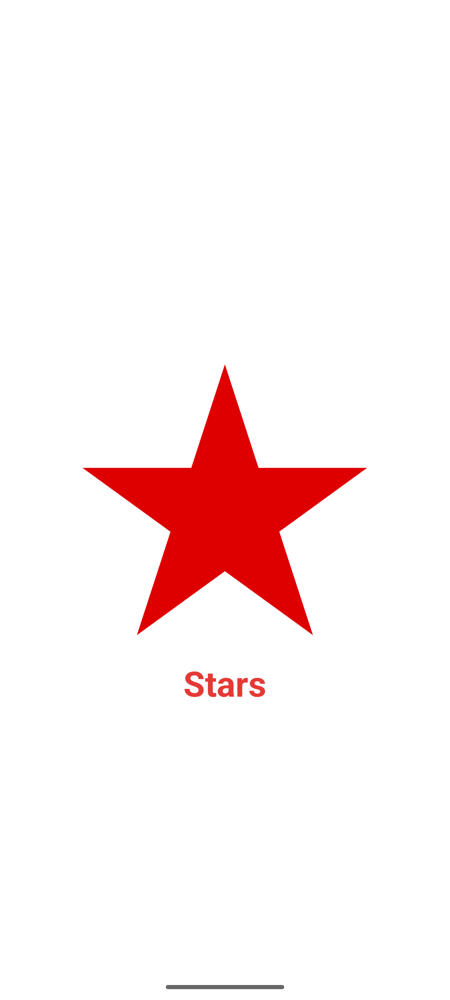
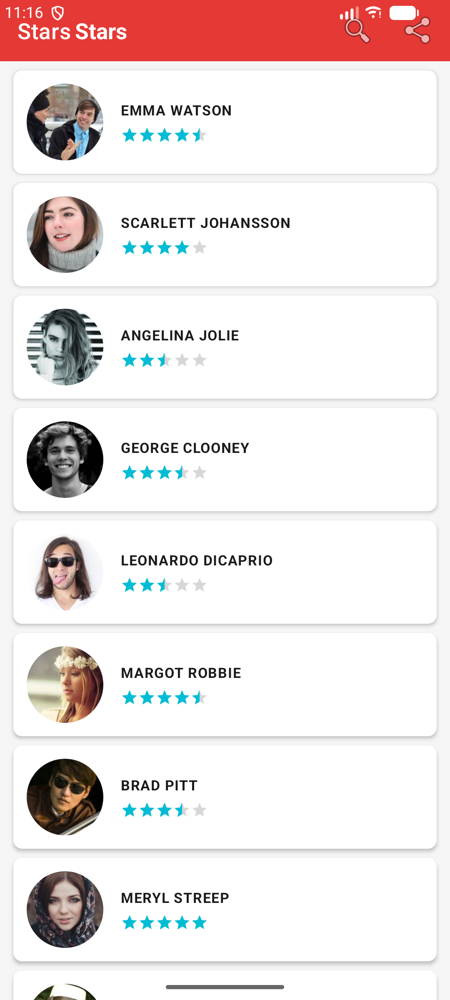
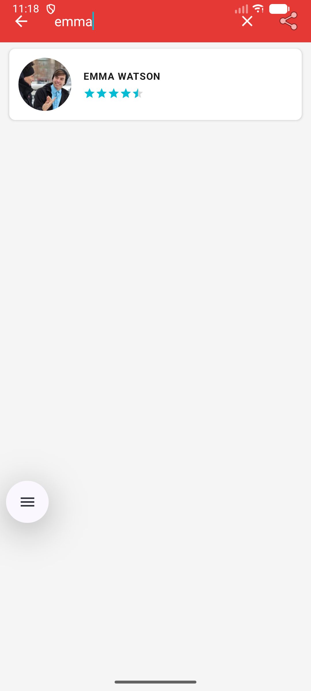

# ⭐ Stars Gallery — Android App


**A modern Android celebrity gallery app — rate your favorite stars in real time**

</div>

---

## 🎬 Demo Video

> 🎥 **Watch the full walkthrough**
https://github.com/user-attachments/assets/0df3df51-6b27-4c7d-93ad-25c99ca8b643

---

## ✨ Features

| Feature | Description |
|---|---|
| 🎬 Animated Splash | Rotating + zooming red star animation on launch |
| 👤 Circular Images | Star photos loaded from internet with Glide `circleCrop` |
| ⭐ RatingBar | Average rating displayed for each star |
| 🔍 Live Search | Real-time filtering by name via `SearchView` in toolbar |
| 📤 Share App | Share the app link via WhatsApp, Gmail, SMS, etc. |
| 💬 Rating Popup | Tap any star → `AlertDialog` popup to update their rating |
| 🔄 Live Update | List updates instantly via `notifyItemChanged()` — no full reload |
| 🎞️ Item Animation | Each card slides in smoothly when the list loads |

---

## 📸 Screenshots

<div align="center">

| Splash Screen | Stars List | Search | Rating Popup |
|:---:|:---:|:---:|:---:|
|  |  |  |  |


---

## 🏗️ Project Structure

```
app/src/main/
│
├── java/com/example/lab7_galeriedestars/
│   │
│   ├── dao/
│   │   └── IDao.java                  # Generic interface (create, update, delete, findAll)
│   │
│   ├── model/
│   │   └── Star.java                  # Data model (id, nom, imageUrl, rating)
│   │
│   ├── service/
│   │   └── StarService.java           # Implements IDao — holds the list of 10 stars
│   │
│   ├── adapter/
│   │   └── StarAdapter.java           # RecyclerView adapter + Glide + filter + animation
│   │
│   ├── SplashActivity.java            # Animated star + 3s delay → MainActivity
│   └── MainActivity.java              # List + Toolbar + SearchView + Share + Popup
│
└── res/
    ├── anim/
    │   ├── star_anim.xml              # Splash: rotate 360° + scale from 0
    │   └── item_anim.xml              # List items: slide up + fade in
    ├── drawable/
    │   └── ic_star_red.jpg            # Splash star image
    ├── layout/
    │   ├── activity_splash.xml        # White background + centered star
    │   ├── activity_main.xml          # Toolbar + RecyclerView
    │   ├── item_star.xml              # Card: circular image + name + RatingBar
    │   └── dialog_rating.xml          # Popup: name + interactive RatingBar
    ├── menu/
    │   └── menu_main.xml              # Toolbar menu: Search + Share
    └── values/
        ├── colors.xml                 # Red primary + cyan accent
        ├── strings.xml
        └── themes.xml                 # NoActionBar theme
```

---

## 🏛️ Architecture — MVC Pattern

```
┌─────────────────────────────────────────────────────┐
│                      VIEW                           │
│   activity_splash.xml  activity_main.xml            │
│   item_star.xml        dialog_rating.xml            │
└────────────────────────┬────────────────────────────┘
                         │
┌────────────────────────▼────────────────────────────┐
│                   CONTROLLER                        │
│   SplashActivity.java    MainActivity.java          │
│   StarAdapter.java                                  │
└────────────────────────┬────────────────────────────┘
                         │
┌────────────────────────▼────────────────────────────┐
│                     MODEL                           │
│   IDao<T>  ←  StarService  →  Star                  │
└─────────────────────────────────────────────────────┘
```

---

## 🛠️ Tech Stack

| Tool | Usage |
|---|---|
| **Java** | Primary language |
| **ViewBinding** | Type-safe view access — no `findViewById` |
| **RecyclerView** | Efficient scrollable star list |
| **Glide 4.16** | Load + cache remote images with `circleCrop` |
| **AlertDialog** | Custom popup for rating update |
| **SearchView** | Real-time name filtering in toolbar |
| **AnimationUtils** | XML-based entry animations per list item |
| **pravatar.cc** | Free avatar API for star photos (`?img=1..70`) |

---

## 🚀 Getting Started

### Prerequisites
- Android Studio Hedgehog (2023.1.1) or newer
- JDK 11 or 21
- Android device or emulator (API 24+)
- Internet connection (images loaded via Glide)

### Installation

```bash
# 1. Clone the repo
git clone https://github.com/laamri/projet_mobile/tree/LAB_7__Galerie_de_Stars.git 

# 2. Open in Android Studio
File → Open → select the project folder

# 3. Sync Gradle
Click "Sync Now" when prompted

# 4. Run
Click ▶  or  Shift + F10
```

---

## 📦 Dependencies

```kotlin
// app/build.gradle.kts
dependencies {
    implementation("androidx.appcompat:appcompat:1.6.1")
    implementation("com.google.android.material:material:1.11.0")
    implementation("androidx.recyclerview:recyclerview:1.3.2")
    implementation("androidx.cardview:cardview:1.0.0")
    implementation("androidx.constraintlayout:constraintlayout:2.1.4")

    // Glide — image loading + circular crop
    implementation("com.github.bumptech.glide:glide:4.16.0")
    annotationProcessor("com.github.bumptech.glide:compiler:4.16.0")
}
```

> ⚠️ Don't forget to add `INTERNET` permission in `AndroidManifest.xml` for Glide to work:
> ```xml
> <uses-permission android:name="android.permission.INTERNET" />
> ```

---

## ⭐ How the Rating System Works

1. User taps a star card in the list
2. `MainActivity` calls `showRatingDialog(star, position)`
3. An `AlertDialog` inflates `dialog_rating.xml` showing the star's name and current rating
4. User drags the `RatingBar` to set a new value (0.5 step)
5. On **Save**: `star.setRating()` updates the model, `StarService.update()` persists it in memory, and `adapter.notifyItemChanged(position)` refreshes only that card — no full list reload

---

## 🤝 Contributing

Pull requests are welcome! For major changes please open an issue first.

---

<div align="center">

Made with ❤️ 

</div>
